# Data Visualizations

This document provides a visual overview of all plots generated in the Nuclear Energy Predictive Modeling project.

---

##  Exploratory Data Analysis (EDA)

### Snapshot Data (Reactor Data)

#### Correlation Matrix
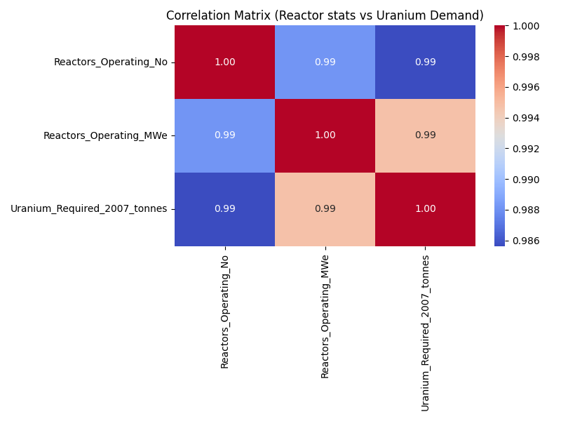
*Shows strong positive correlation between reactor capacity (MWe) and uranium demand*

#### Top Uranium Consumers
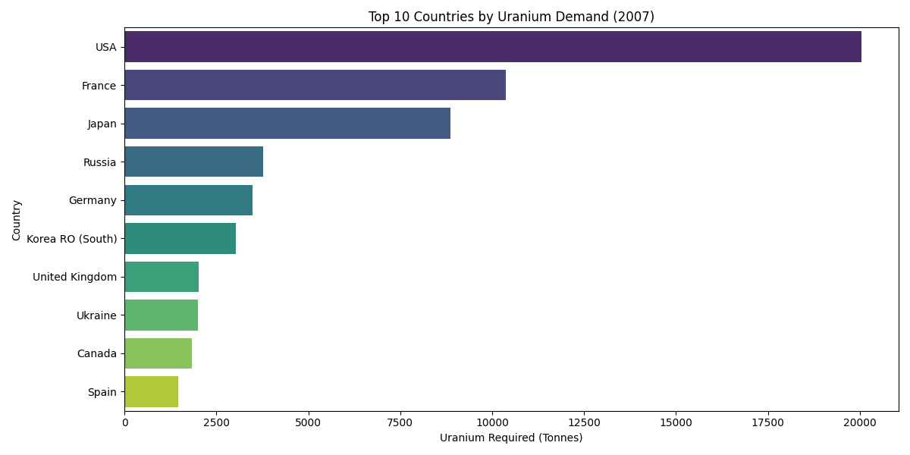
*Bar chart showing countries with highest uranium requirements*

#### Pairplot Analysis
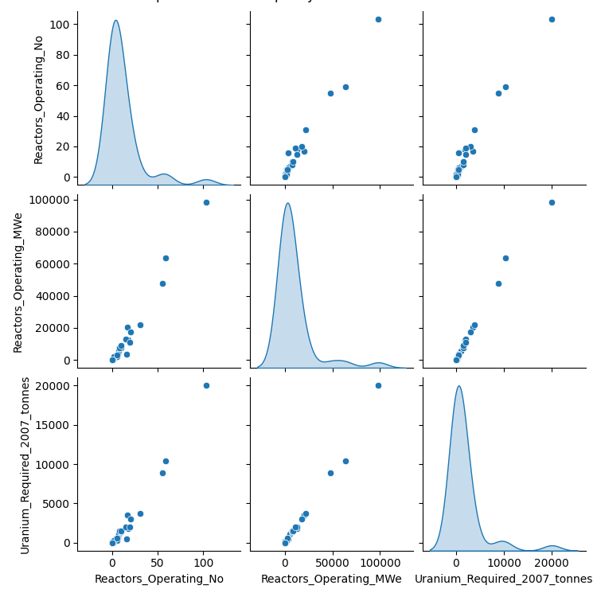
*Scatter plot matrix showing relationships between all variables*

### Time-Series Data (2007-2025)

#### Historical Trend
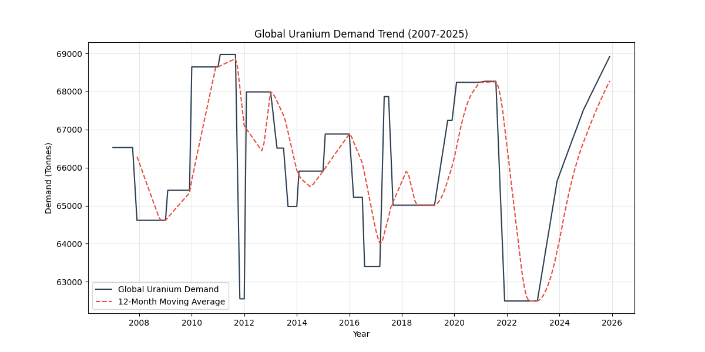
*Global uranium demand over 18 years showing steady upward trajectory*

#### Distribution Analysis
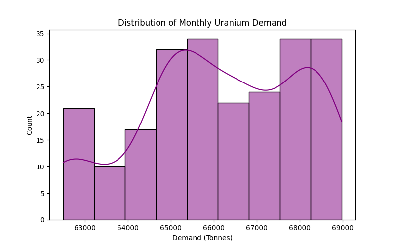
*Histogram and density plot of uranium demand values*

#### ACF/PACF Analysis
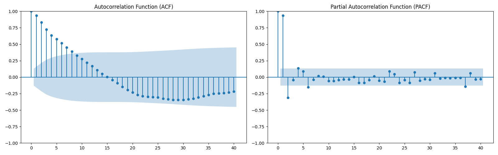
*Autocorrelation plots used to determine SARIMA parameters*

---

##  Regression Models (Capacity → Demand)

### Model Performance & Validation

#### Model Comparison
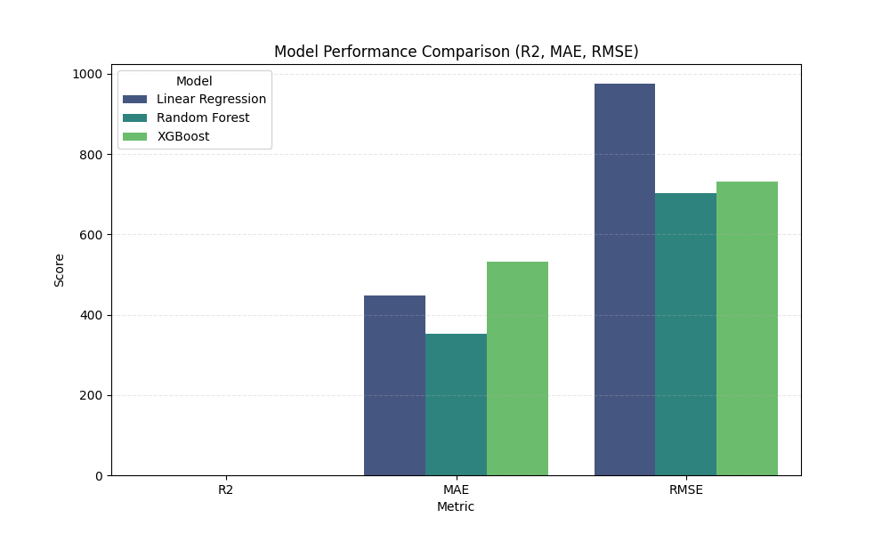
*Bar chart comparing R², MAE, and RMSE across all three models*

#### Residual Analysis
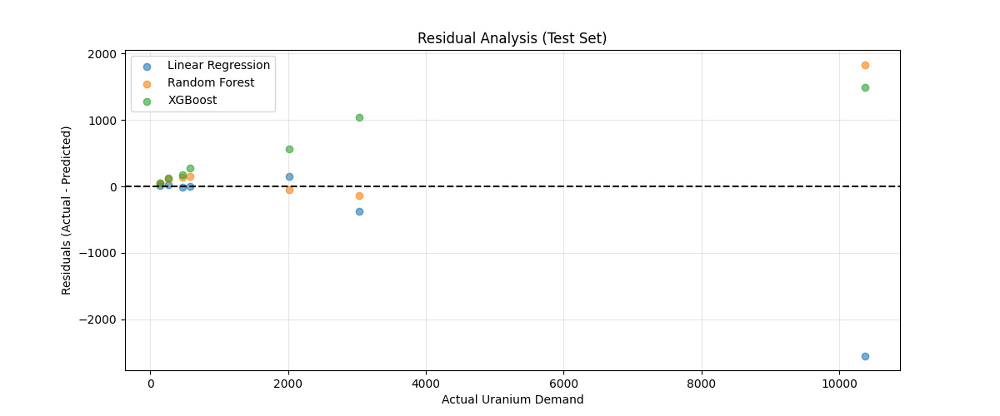
*Scatter plot showing prediction errors are randomly distributed around zero*

#### Actual vs Predicted
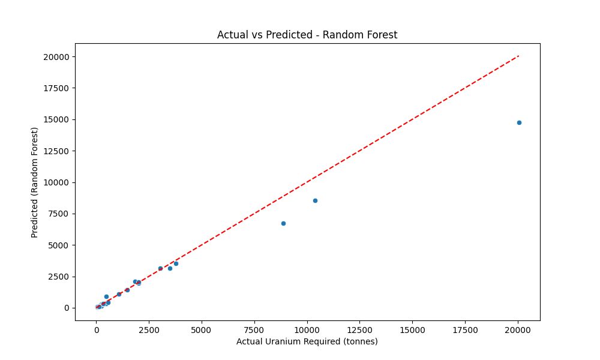
*Points cluster tightly around diagonal, demonstrating 95.73% R² accuracy*

#### Feature Importance

*Reactor capacity (MWe) is the dominant predictor in Random Forest model*

### Future Projections

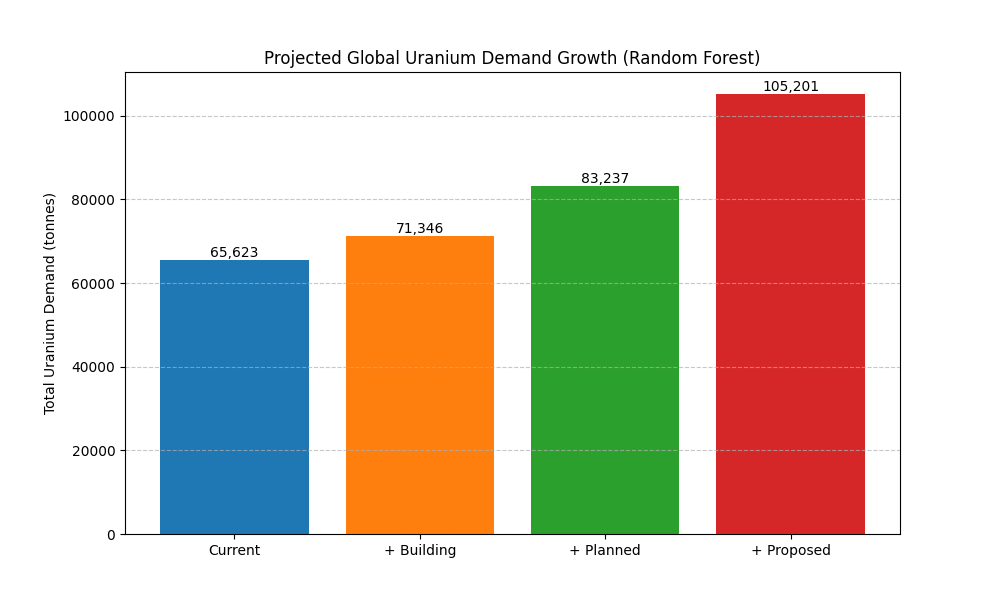
*Scenario analysis showing potential 44% increase if all proposed reactors are built*

---

## Time-Series Forecasting (SARIMA)

### Model Validation & Forecasting

#### Seasonal Decomposition
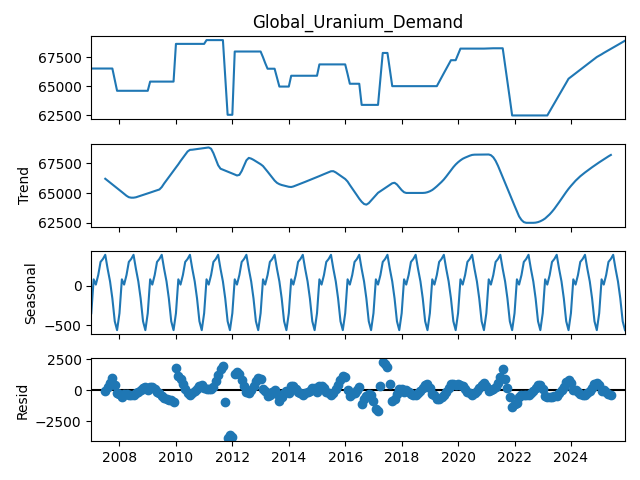
*Breaks down time series into trend, seasonal, and residual components*

#### Backtest Validation
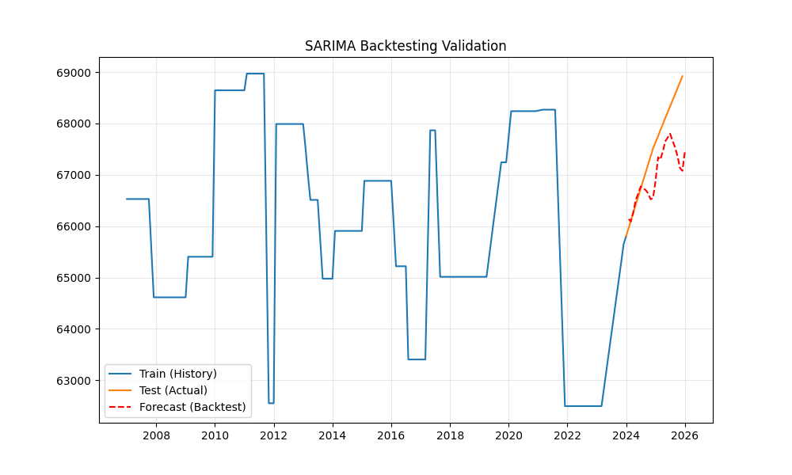
*SARIMA forecast vs actual 2024-2025 data (MAE: 594 tonnes, <1% error)*

#### 5-Year Forecast
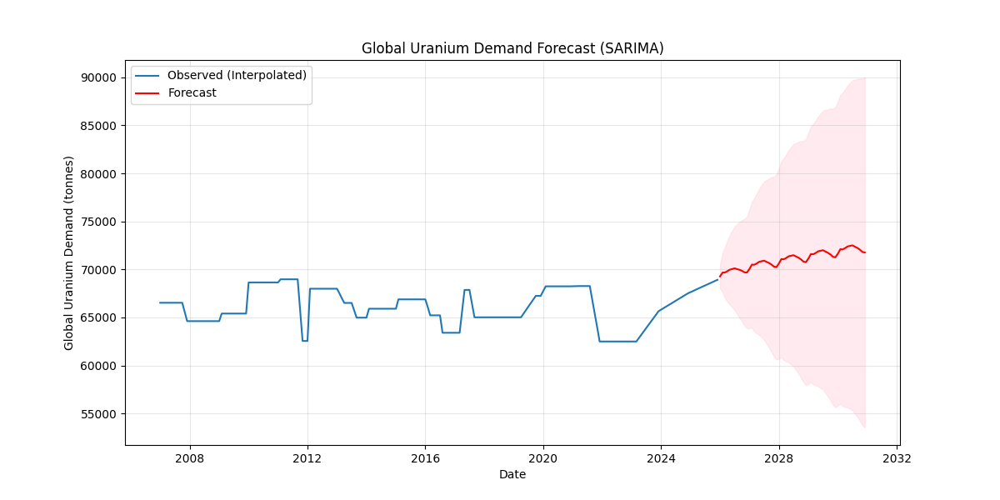
*Predicts demand reaching ~71,700 tonnes by 2030 with confidence intervals*

---

##  Summary Statistics

### Regression Model Performance (Test Set)
| Model | R² Score | MAE (tonnes) | RMSE (tonnes) |
|-------|----------|--------------|---------------|
| **Random Forest** | **0.9573** | **353.45** | **701.73** |
| XGBoost | 0.9536 | 530.88 | 731.61 |
| Linear Regression | 0.9176 | 447.77 | 975.29 |

### SARIMA Model Performance (Backtest)
| Metric | Value | Interpretation |
|--------|-------|----------------|
| MAE | 594.51 tonnes | Average forecast error |
| RMSE | 741.33 tonnes | Error with penalty for outliers |
| **Relative Error** | **~0.8%** | Error as % of total demand |

---

## Key Takeaways

1. **Strong Predictive Accuracy:** Regression models achieve 95.73% R² on test data
2. **Validated Forecasting:** SARIMA model achieves <1% error on 2024-2025 backtest
3. **Comprehensive Testing:** All models validated using train-test splits and backtesting
4. **Future Outlook:** Demand projected to reach ~71,700 tonnes by 2030
5. **Scenario Planning:** Potential 44% increase if all proposed reactors come online

---

**All visualizations are located in:**
- EDA: `ml_pipeline/visualizations/eda/`
- Regression: `ml_pipeline/regression_analysis/visualizations/`
- Time-Series: `ml_pipeline/time_series_forecast/visualizations/`
